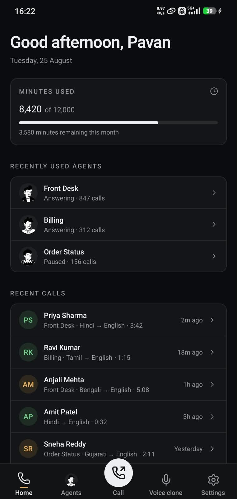
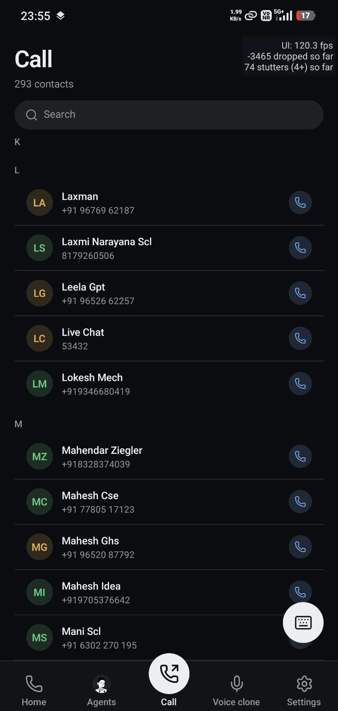
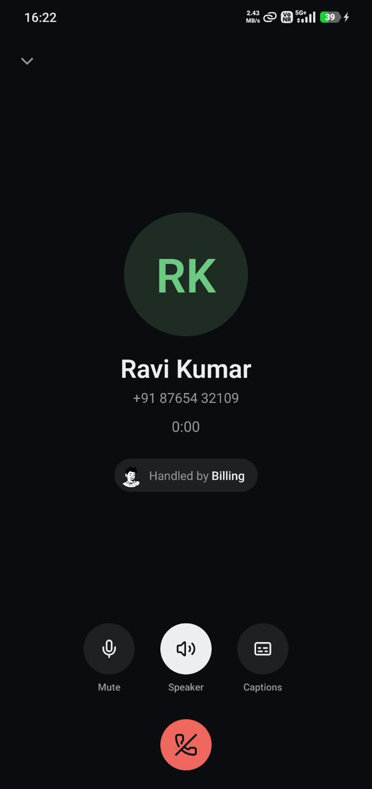
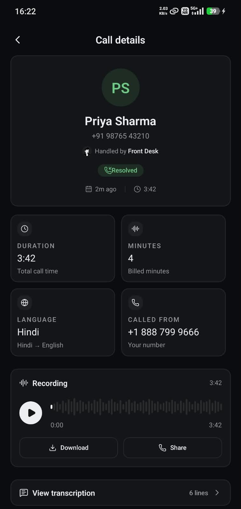
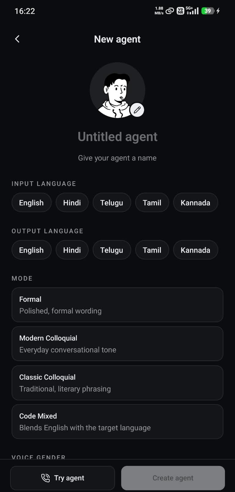
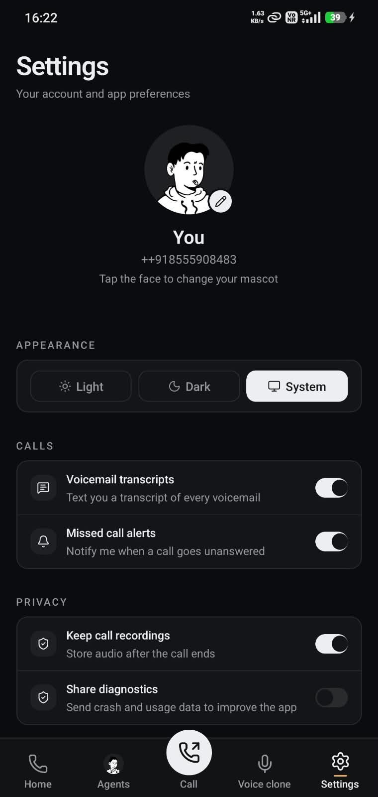

# RiverVoice

Voice agents that answer the phone in Indian languages. You describe an agent in
a browser, give it a voice, and it takes calls — over WebRTC from the mobile app,
or as a real phone call bridged through Twilio.

Three services, two languages, plus a self-hosted Supabase stack for auth and data:

|            | what it does                                              | stack                |
| ---------- | ---------------------------------------------------------- | --------------------- |
| **web**    | the builder and dashboard                                   | Next.js, TypeScript   |
| **ferry**  | the live call: WebRTC, Twilio, speech, translation, audio   | Rust, axum, tokio     |
| **mobile** | the calling client — one of two things that talk to ferry   | Expo, React Native    |

**web still runs on mock data** (`web/src/lib/mock-data.ts`) — there is no live
API call for agents, auth, or pricing in web today. Real persistence exists, but
mobile is the client that talks to it, not web: agents/calls/users live in
Postgres, mobile reads/writes most of that directly via PostgREST, and Supabase
Auth (GoTrue) handles sign-in. See [The shape of the system](#the-shape-of-the-system).

---

## Screenshots

<table>
  <tr>
    <td align="center" width="33%">
      <br>
      <sub>Home</sub>
    </td>
    <td align="center" width="33%">
      <br>
      <sub>Call</sub>
    </td>
    <td align="center" width="33%">
      <br>
      <sub>In call</sub>
    </td>
  </tr>
  <tr>
    <td align="center" width="33%">
      <br>
      <sub>Call details</sub>
    </td>
    <td align="center" width="33%">
      <br>
      <sub>New agent</sub>
    </td>
    <td align="center" width="33%">
      
      <br><sub>Settings</sub>
    </td>
  </tr>
</table>

---

## Contents

- [Screenshots](#screenshots)
- [The shape of the system](#the-shape-of-the-system)
- [Running it](#running-it)
- [web](#web)
- [ferry](#ferry)
- [mobile](#mobile)
- [Conventions](#conventions)

---

## The shape of the system

```
   browser ────────▶  web       :3000    Next.js — builder, dashboard
                                          (mock data, no backend yet)

   mobile ──WebRTC─▶  ferry     :8085    Rust — STT, MT, TTS, call bridging
   Twilio  ──PSTN───▶

   mobile ──PostgREST/Auth──▶  kong :8000 ─▶ auth (GoTrue), rest (PostgREST), db (Postgres)
                                             self-hosted Supabase, docker-compose.yml
```

web and ferry don't talk to each other in production use — web is a design-time
tool for building an agent's config; ferry is the run-time engine that answers
a call. The one place they meet is ferry's `/v1/try-agent/offer` route, a
one-way WebRTC demo web's builder can open directly in the browser to preview
an agent without going through mobile or Twilio at all.

**mobile is the real client of the Supabase stack.** It signs in against
Supabase Auth (Google ID-token flow) and reads/writes `agents` directly via
PostgREST (`mobile/lib/agents/api.ts`, `mobile/lib/supabase.ts`) — RLS-scoped
to the caller, no ferry handler involved. ferry only keeps the handlers that
plain row CRUD can't express or that need real server-side work:
`GET /v1/agents/recent` (a join+aggregate PostgREST's row-level API can't do
without a view/RPC), `POST /v1/voices/preview` (calls Sarvam TTS for real),
and everything about actually running a call. ferry verifies the same
Supabase-issued access token mobile already holds (`Authorization: Bearer
<token>`, `auth/middleware.rs`) rather than mediating sign-in itself — the
first authenticated request from a given Supabase user is what creates their
row in ferry's own `users` table, lazily, with no dedicated sign-up endpoint.

ferry additionally persists a call's own record (`calls`, `call_utterances`)
straight to Postgres via `sea-orm` (`ferry/src/db/`), connecting as the
`postgres` superuser to bypass RLS for its own writes — separate from the
PostgREST path mobile uses for `agents`.

A real, two-leg call, end to end:

```
mobile places a call ──POST /v1/call/start──▶ ferry
                                                 │
                          ┌──────────────────────┴──────────────────────┐
                          │                                              │
                 leg A: WebRTC (mobile)                       leg B: Twilio (PSTN)
                          │                                              │
                          └──────────two independent pipelines──────────┘
                                 pipeline a2b: STT(A) → MT → TTS(B)   → what B hears
                                 pipeline b2a: STT(B) → MT → TTS(A)   → what A hears
```

Twilio's leg connects back to ferry over its own Media Streams websocket
(`GET /v1/twilio/ws/{call_id}`) and status webhook
(`POST /v1/twilio/status/{call_id}`), correlated to the WebRTC leg by the
`call_id` ferry mints when the call starts. See [ferry](#ferry) for how the
two pipelines get cross-wired.

---

## Running it

You need Node 20+, Rust, and Docker (for the local Supabase stack: Postgres,
GoTrue, PostgREST, Storage, Kong — all via `docker-compose.yml`).

```bash
cp .env.example .env          # fill in the real secrets — Twilio, Sarvam,
                               # Deepgram, OpenRouter, Google client ID.
                               # The Postgres/JWT/anon-key values are
                               # working local-dev defaults, no need to
                               # change them unless you know you want to.

docker compose up -d          # db, auth, rest, storage, kong :8000

cd web     && npm install && npm run dev     # :3000
cd ferry   && cargo run                      # :8085 — loads the root .env
                                              # first, then falls back to
                                              # its own ferry/.env if present
cd mobile  && npm install && npx expo run:android   # or run:ios — needs a dev client
```

mobile needs `EXPO_PUBLIC_SUPABASE_URL`/`EXPO_PUBLIC_SUPABASE_ANON_KEY`
pointing at kong (`http://<lan-ip>:8000` for a physical device,
`http://127.0.0.1:8000` for an emulator on the same machine), and
`EXPO_PUBLIC_FERRY_URL` pointing at ferry the same way. A physical device also
needs ferry's own `WEBRTC_BIND_IP` set to that same LAN address, or the SDP
negotiates fine and no audio ever arrives. See `mobile/.env.example`.

---

## web

Next.js App Router, TypeScript, Tailwind v4, Base UI primitives.

```
src/
  app/
    (auth)/          sign-in, sign-up, verify
    (app)/           home, agents        — the shell with the sidebar
    (site)/          marketing pages
    build-agent/     the builder, its own layout
    artifacts/, shelf-preview/    standalone preview routes
  components/
    dashboard/       agent board, composer, templates
    builder/         settings, tools, variables, assistant
    ui/              Base UI wrappers — button, dialog, data-table
  lib/
    mock-data.ts     stand-ins for persisted data
    agents/          queries and schemas per resource, reading mock-data
    auth/, pricing/, tools/    same pattern — mocked, not fetched
    webrtc/          the try-agent WebRTC demo client, talks to ferry directly
  mascots/           the agent avatars — art, not components
  motion/            the hand-drawn walkthrough engine
```

**There is no live API call for agents, auth, or pricing.** `lib/api.ts` is
now just an `ApiError` type — the fetch wrapper it used to hold is gone.
`lib/agents/server.ts` and friends resolve against
`lib/mock-data.ts` through the same async function shapes a real fetch would
have, so swapping in a real backend later is a matter of replacing the
function bodies, not the call sites or the TanStack Query hooks around them:

```ts
export const agentsQueryKey = ["agents"] as const;

export function useAgents() {
  return useQuery({
    queryKey: agentsQueryKey,
    queryFn: () => getAgents(), // reads lib/mock-data.ts today
  });
}
```

**The one thing web does talk to for real is ferry**, and only for the
try-agent preview: `lib/webrtc/` opens a WebRTC connection straight to
`POST /v1/try-agent/offer` so you can hear an agent from the browser while
building it, without mobile or a phone call involved.

**`mascots/` and `motion/` are libraries, not components.** Nothing in them
imports from `components/`, which is what lets the art render server-side, or
in a script that uploads an avatar. `mascots/parts.ts` is path data;
`mascots/bot.ts` is the seeded assembler that picks from it.

---

## ferry

Rust, axum, tokio. Holds a call's sockets open for its whole duration and runs
the pipeline that turns what someone says into translated speech, frame by
frame, in real time — for a WebRTC connection, a Twilio phone call, or both at
once, bridged. Also owns a thin slice of persistence: call records, and the
`users` row created lazily on a caller's first authenticated request.

```
ferry/src/
  main.rs
  config.rs           env vars — DB, JWT secret, API keys, PUBLIC_BASE_URL, WEBRTC_BIND_IP
  logging.rs           ColorEventFormatter — [call_id=... leg=...] prefixes, per-stage colors
  pricing.rs            per-vendor cost tables, for the billing/usage observers
  auth/
    token.rs              verifies a Supabase-issued (GoTrue) access token
    middleware.rs          require_user — Bearer token in, UserSession out;
                            also lazily provisions the caller's ferry-side users row
  db/
    mod.rs                 sea-orm connection, DATABASE_URL
    entity/                 agents, calls, call_utterances, users — hand-written
                             or sea-orm-cli-generated entities
  call/
    mod.rs                call_span(call_id, leg) — the tracing correlation helper
    registry.rs           CallRegistry / CallHandle — correlates a WebRTC leg with
                           Twilio's later, otherwise-unrelated WS connection
  http/
    router.rs             axum Router, routes, CORS, request-id middleware
    handlers/
      try_agent.rs           POST /v1/try-agent/offer — one-way demo, no registry
      call.rs                POST /v1/call/start — the real two-leg call
      twilio.rs              GET /v1/twilio/ws/{id}, POST /v1/twilio/status/{id}
      agent.rs                GET /v1/agents/recent — the one agent read PostgREST can't do alone
      voice.rs                POST /v1/voices/preview — calls Sarvam TTS for real
    state.rs
  frames.rs            Frame / FrameKind — the value every stage passes on
  processor.rs         FrameProcessor / FrameIo — the contract a stage implements
  pipeline.rs          Pipeline::spawn — chains stages + observers into one call
  stages/               one file per pipeline stage: stt.rs, mt.rs, tts.rs
  services/             outbound clients that call vendor APIs
    stt/, mt/, tts/        provider.rs trait + one file per vendor
    twilio/                TwilioClient — fires outbound calls, hangs up by CallSid
    ws_client.rs            reconnecting websocket client shared by STT/TTS
  codec/                FrameSerializer impls — Frame ⇄ wire bytes, one per protocol
    frame_serializer.rs    the FrameSerializer trait
    transport/               webrtc_dc.rs, telephony/twilio.rs (mu-law, resampling)
    stt/, tts/                vendors' own wire framing (Deepgram JSON, Sarvam stream)
  transport/            holds a call's sockets open
    base.rs               BaseTransport<S: FrameSerializer>
    pacing.rs              FramePacer — steady wall-clock cadence, no bursts
    webrtc/                WebRtcClient — SDP offer/answer, real Opus RTP track
    websockets/             WebSocketClient — generic WS loop, used by Twilio
  observer/             read-only taps on the frame stream
    billing_observer.rs, usage_observer.rs, latency_observer.rs, log_observer.rs,
    call_record_observer.rs   writes the call's row/utterances to Postgres
  audio/                 opus, resampling (rubato, sinc — not naive decimation), VAD
```

Plain CRUD on `agents` (and read-only access to `calls`) goes straight from
mobile to PostgREST, RLS-scoped to the caller — see `docker-compose.yml`'s
`rest`/`kong` services. What's left on ferry is only what PostgREST's
row-level API can't express, or that needs real server-side orchestration.
See [ferry/AGENTS.md](ferry/AGENTS.md) for the full internals doc this
section summarizes.

```
GET  /health
POST /v1/try-agent/offer          SDP offer in, SDP answer out — one-way demo
POST /v1/call/start               starts a real two-leg call (WebRTC + Twilio)
GET  /v1/twilio/ws/{call_id}      Twilio's Media Streams websocket
POST /v1/twilio/status/{call_id}  Twilio's call-status webhook
GET  /v1/agents/recent            protected — at most 3, most recently called first
POST /v1/voices/preview           protected — a base64 WAV clip of a voice, via Sarvam
```

All routes except `/health` and the Twilio routes require `Authorization:
Bearer <supabase-access-token>`.

### The frame pipeline

Every stage — STT, MT, TTS — implements `FrameProcessor` and gets a `FrameIo`:
an inbound channel, an outbound channel, and the observer list.
`Pipeline::spawn` chains the stages' channels into one queue, audio in one
end, translated audio out the other:

```rust
pub trait FrameProcessor {
    fn name(&self) -> &'static str;
    async fn run(self: Box<Self>, io: FrameIo);
}
```

A pipeline is direction-specific — one `STT(lang) → MT → TTS(lang)` chain.

### Two-leg calls are two pipelines, cross-wired

A real call (`http/handlers/call.rs`) builds **two** pipelines, not one
self-looped one:

```
pipeline_a2b: STT(A's lang) → MT → TTS(B's lang)   // what B hears
pipeline_b2a: STT(B's lang) → MT → TTS(A's lang)   // what A hears
```

`FrameIo::into_parts()` splits each pipeline into raw `(Receiver, Sender)`
halves, and those halves are paired into the *other* leg's transport at
construction time — A's WebRTC transport reads `b2a`'s output and feeds
`a2b`'s input; Twilio's transport is the mirror. Nothing is moved "in flight"
later; the wiring at construction is the whole mechanism.

`CallRegistry`/`CallHandle` (`call/registry.rs`) is what lets Twilio's later,
otherwise-unrelated websocket connection and status webhook find the call A
already started — both only carry the `call_id` embedded in the URLs ferry
handed Twilio. `/v1/try-agent/offer` deliberately skips all of this: one
pipeline, self-looped, no registry, no Twilio — a way to hear an agent from a
browser tab.

### Providers are traits, codec is the wire format — two different jobs

`services/{stt,mt,tts}/provider.rs` define what a vendor integration must
implement. Swapping the MT vendor from Sarvam to an OpenRouter model, or
adding a new STT provider, is a new file under `services/`, not a change to
`stages/`.

`codec/` is a separate concern: it implements `FrameSerializer`, converting a
`Frame` to and from whatever bytes a specific transport or vendor protocol
expects. `codec/transport/telephony/twilio.rs` also owns the 16kHz↔8kHz
resampling and the mu-law codec Twilio's phone-quality audio needs — done with
`rubato`'s sinc interpolation, not naive decimation, which scrambles audio
rather than just aliasing it.

### Why Rust

A call is a WebRTC connection or a Twilio phone call held open for minutes,
with a second socket to the STT provider and a third to TTS, per leg. The work
is IO-bound with hard latency limits and no room for a GC pause during
someone's sentence.

Providers drop idle sockets — Deepgram closes on inactivity — so the STT
client sends a keepalive frame periodically and reconnects with backoff
(`services/ws_client.rs`) rather than dropping the call.

---

## mobile

Expo (React Native), TypeScript, NativeWind. The calling client, and the real
client of the Supabase stack — one of the two things that talk to ferry
directly (the other is web's try-agent preview).

```
mobile/
  app/                    expo-router routes
    (auth)/                  sign-in, sign-up
    (tabs)/                  agents, call, phonebook, settings
    agent-detail.tsx, call-detail.tsx, transcript.tsx, try-agent.tsx, ...
  screens/                 the screen implementations, one folder per screen
  components/
    ui/                      rn-primitives wrappers — button, dialog, select, toast
  lib/
    supabase.ts              the shared Supabase client — auth + direct PostgREST
    bindings/supabase.ts      generated table types
    auth/tokens.ts            in-memory mirror of the current access token
    agents/api.ts             agents CRUD, straight to PostgREST (RLS-scoped);
                              getRecentAgents/previewVoice still hit ferry
    calls/api.ts              same pattern for calls
    webrtc/
      signaling.ts            POSTs to ferry (/v1/call/start or /v1/try-agent/offer)
      ferry-call.ts            RTCPeerConnection lifecycle for one call
      wire.ts                  the mobile-side frame wire format
    mascots/                 shared with web's avatar system, kept in sync by hand
    theme.tsx
  providers/, state/session/  auth session — Supabase's own, not a custom cookie
```

**mobile calls ferry directly** — web only does for its try-agent preview.
`lib/webrtc/signaling.ts` posts to ferry, gets back an SDP answer, and
`ferry-call.ts` drives the `RTCPeerConnection` from there:

```ts
const DEFAULT_FERRY_URL = "http://127.0.0.1:8085";
process.env["EXPO_PUBLIC_FERRY_URL"] ?? DEFAULT_FERRY_URL;
```

The default only works from an emulator on the same machine as ferry. A
physical device needs `EXPO_PUBLIC_FERRY_URL` set to ferry's LAN address, and
ferry's own `WEBRTC_BIND_IP` set to that same address — otherwise the SDP
negotiates fine and no audio ever arrives. The same applies to
`EXPO_PUBLIC_SUPABASE_URL`, which points at kong, not any individual Supabase
service directly.

**`lib/webrtc/wire.ts` mirrors web's `lib/webrtc/wire.ts` by hand**, the same
way `components/ui/` and `lib/mascots/` mirror web's — there's no shared
package between the two clients, so a change to ferry's data-channel tag
bytes needs the same edit made twice. They are currently out of sync: web's
copy has two tag kinds (`PeerConnected`, `Ringing`) mobile's doesn't yet have.
Check both before assuming ferry's wire format is fully documented in either
one.

```bash
cd mobile && npm install
npx expo run:android   # or run:ios
```

Native modules (`react-native-webrtc`, `react-native-incall-manager`) mean
Expo Go can't run this app — use `run:android`/`run:ios` to build a dev
client, or `expo-dev-client` if one's already installed on the device.

---

## Conventions

**Comments explain why, not what.** If the code says it, the comment does
not. The ones worth writing are the non-obvious constraints — why a mu-law
bias mismatch sounds like distortion and not silence, why the mouth animation
only works on one mascot style, why a stroke carries `pathLength="1"`.

**Errors are mapped, not pre-checked**, wherever there's a place that would
apply — check-then-act races two simultaneous requests; prefer doing the
thing and mapping the failure.

**Commits are small and explain the reasoning.** The subject says what
changed, the body says why it was done that way.

**Pre-commit runs** prettier and rustfmt, plus the usual whitespace and
merge-conflict checks. CI runs one workflow per service
(`.github/workflows/ferry.yml`, `web.yml`, `mobile-android-build.yml`),
path-filtered so a web change does not rebuild ferry.

**PRs get two automated reviewers.** CodeRabbit comments on every PR (config
in [.coderabbit.yaml](.coderabbit.yaml)); Claude Code reviews are run manually
via `/code-review`. Neither replaces a human review before merge.
